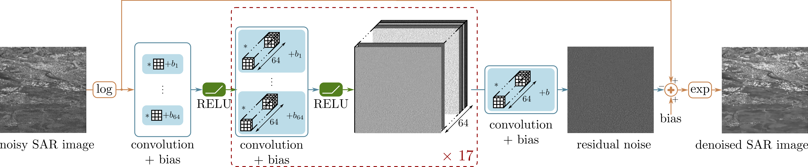

**Please note that the up-to-date official repository has been moved to https://gitlab.telecom-paris.fr/RING/SAR-CNN**

# SAR Image Despeckling by Deep Neural Networks: from a pre-trained model to an end-to-end training strategy
## Emanuele Dalsasso, Xiangli Yang, Loïc Denis, Florence Tupin, Wen Yang
## Abstract
_Speckle reduction is a longstanding topic in synthetic aperture radar (SAR) images. Many different schemes have been proposed for the restoration of intensity SAR images. Among the different possible approaches, methods based on convolutional neural networks (CNNs) have recently shown to reach state-of-the-art performance for SAR image restoration. CNN training requires good training data: many pairs of speckle-free / speckle-corrupted images. This is an issue in SAR applications, given the inherent scarcity of speckle-free images. To handle this problem, this paper analyzes different strategies one can adopt, depending on the speckle removal task one wishes to perform and the availability of multitemporal stacks of SAR data. The first strategy applies a CNN model, trained to remove additive white Gaussian noise from natural images, to a recently proposed SAR speckle removal framework: MuLoG (MUlti-channel LOgarithm with Gaussian denoising). No training on SAR images is performed, the network is readily applied to speckle reduction tasks. The second strategy considers a novel approach to construct a reliable dataset of speckle-free SAR images necessary to train a CNN model. Finally, a hybrid approach is also analyzed: the CNN used to remove additive white Gaussian noise is trained on speckle-free SAR images. The proposed methods are compared to other state-of-the-art speckle removal filters, to evaluate the quality of denoising and to discuss the pros and cons of the different strategies. Along with the paper, we make available the weights of the trained network to allow its usage by other researchers._



## Resources
## Resources
- [Paper (ArXiv)](https://arxiv.org/abs/2006.15559)
- [Remot Sensing publication](https://www.mdpi.com/2072-4292/12/16/2636)

To cite the article:
```
Dalsasso, E.; Yang, X.; Denis, L.; Tupin, F.; Yang, W. 
SAR Image Despeckling by Deep Neural Networks: from a Pre-Trained Model to an End-to-End Training Strategy. 
Remote Sens. 2020, 12, 2636. https://doi.org/10.3390/rs12162636 
```

## Licence

The material is made available under the **GNU General Public License v3.0**: Copyright 2020, Emanuele Dalsasso, Loïc Denis, Florence Tupin, of LTCI research lab - Télécom ParisTech, an Institut Mines Télécom school.
All rights reserved.
